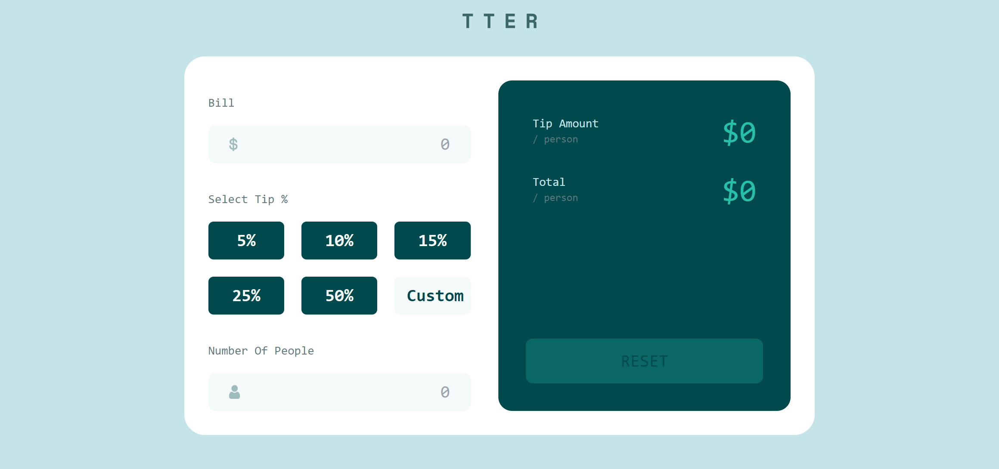

# Frontend Mentor - Tip calculator app solution

This is a solution to the [Tip calculator app challenge on Frontend Mentor](https://www.frontendmentor.io/challenges/tip-calculator-app-ugJNGbJUX). Frontend Mentor challenges help you improve your coding skills by building realistic projects.

## Table of contents

- [Frontend Mentor - Tip calculator app solution](#frontend-mentor---tip-calculator-app-solution)
  - [Table of contents](#table-of-contents)
  - [Overview](#overview)
    - [The challenge](#the-challenge)
    - [Screenshot](#screenshot)
    - [Links](#links)
  - [My process](#my-process)
    - [Built with](#built-with)
    - [What I learned](#what-i-learned)
  - [Author](#author)

## Overview

### The challenge

Users should be able to:

- View the optimal layout for the app depending on their device's screen size
- See hover states for all interactive elements on the page
- Calculate the correct tip and total cost of the bill per person

### Screenshot

### Links

- Solution URL: [Add solution URL here](https://your-solution-url.com)
- Live Site URL: [Add live site URL here](https://your-live-site-url.com)

## My process

### Built with

- Semantic HTML5 markup
- Tailwindcss
- Mobile-first workflow
- [React](https://reactjs.org/) - JS library
- Typescript
- Spring.js animation library

### What I learned

In this project I learned how to use TypeScript with React, Handling global state with context-API and custom-hooks

## Author

- Website - [mostafa meerzad](https://mostafa-meerzad.github.io/portfolio/)
- Linkedin - [mostafa meerzad](www.linkedin.com/in/mostafa-meerzad-a753371b7)
- Github - [mostafa-meerzad](https://github.com/mostafa-meerzad)
- Frontend Mentor - [mostafa-meerzad](https://www.frontendmentor.io/profile/mostafa-meerzad)
